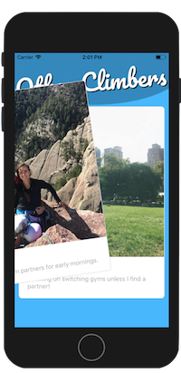

# Belaytionship

Belaytionship is a React Native application that allows users to sign up using their Facebook account and find climbing partners in their area.  This is not a dating app, and to remove the element of romance from the app, users are not able to filter their potential matches by neither age or gender.  

## Getting Started

Prerequisites: NodeJS

1. Clone the GitHub repository.

$ git clone https://github.com/eddiemarovich/belaytionship.git

2. Install dependencies.

$ npm install

3. Install the Expo Desktop app: https://docs.expo.io/versions/latest/introduction/installation.html

$ cd belaytionship-app

$ exp start

4. Install the x code simulator from the app store to run the simulator through Expo.

## Navigating the App

Login Using Facebook authentication

You will be routed to "Your Profile" where you have the ability to update your Bio.  This is the information other users will be able to look at to decide if they would like to try to match with you.

Scroll over to the right to view your matches.  When matched with someone, you have access to their email address, and connect with them via email.

Scroll to the right again to find the "Other Climbers" page.  Here is where you can swipe through the stack of users and swipe left to decline, or right to accept.  When matched with a user, a screen will pop up notifying you that you have a new match.

## Technologies
* React Native
* Firebase

## Team Members
* [Eddie Marovich](https://github.com/eddiemarovich)
